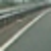
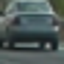
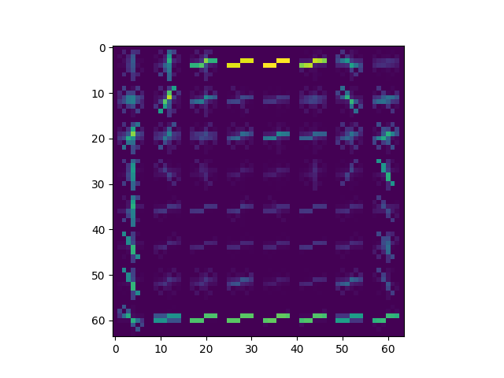
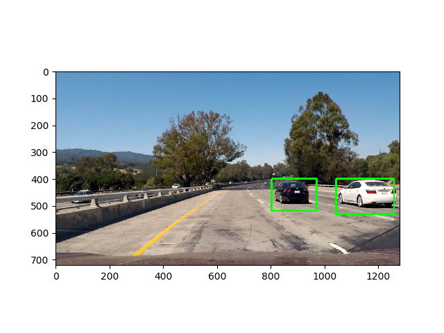
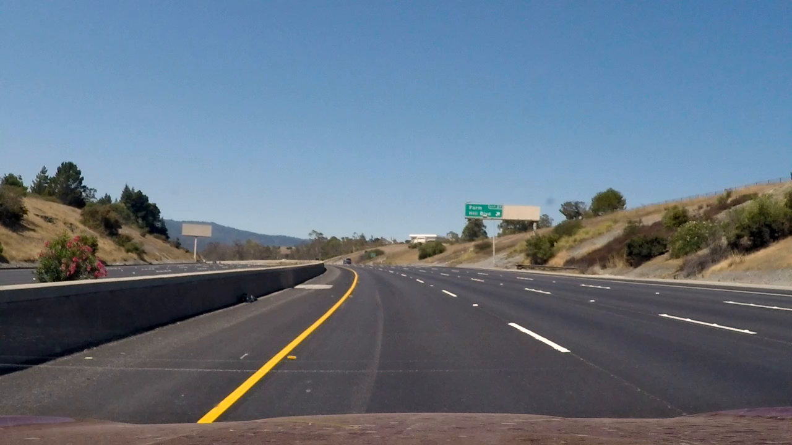
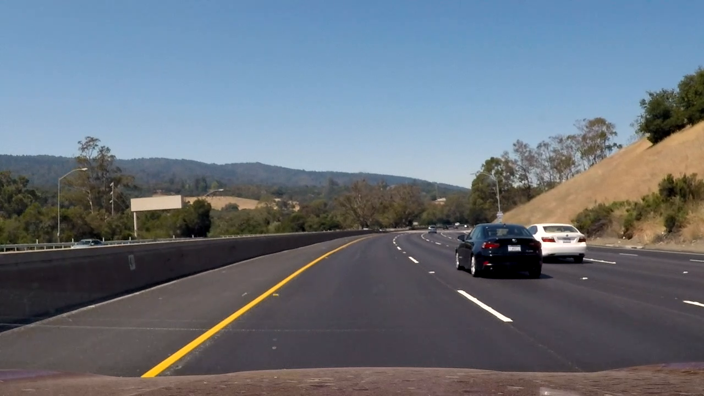
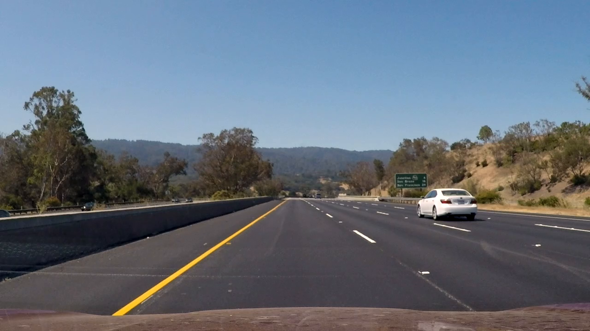
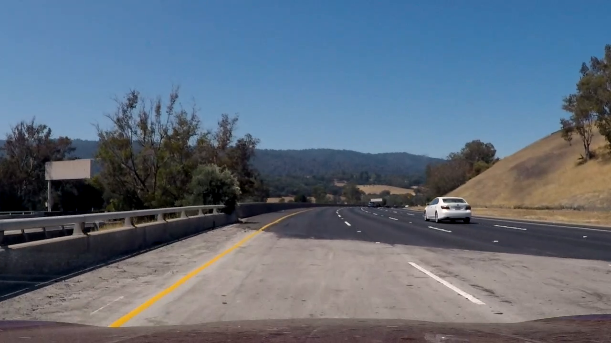
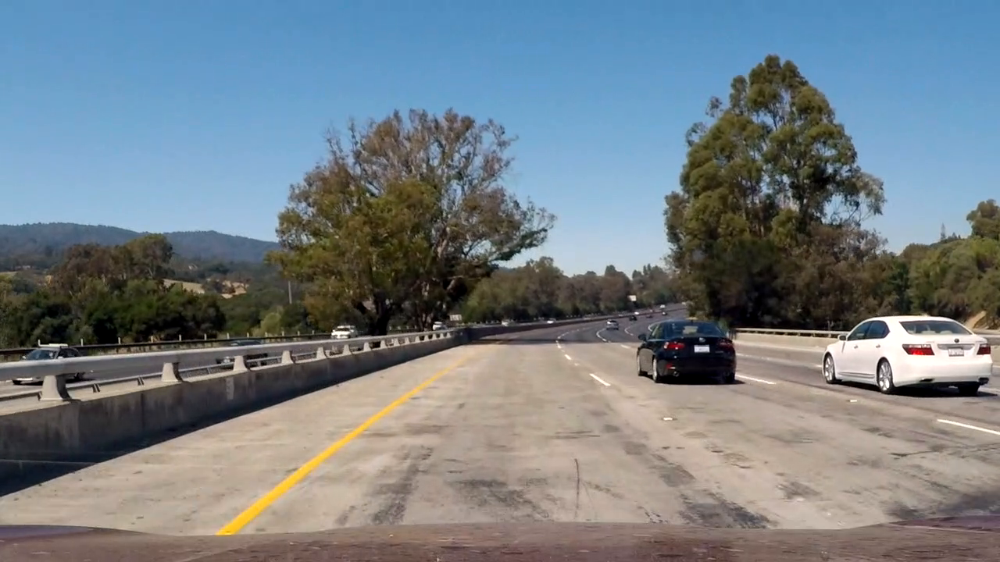
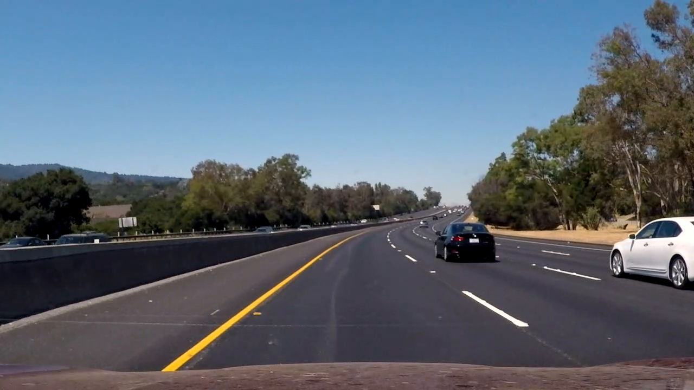

##Writeup Template
###You can use this file as a template for your writeup if you want to submit it as a markdown file, but feel free to use some other method and submit a pdf if you prefer.

---

**Vehicle Detection Project**

The goals / steps of this project are the following:

* Perform a Histogram of Oriented Gradients (HOG) feature extraction on a labeled training set of images and train a classifier Linear SVM classifier
* Optionally, you can also apply a color transform and append binned color features, as well as histograms of color, to your HOG feature vector. 
* Note: for those first two steps don't forget to normalize your features and randomize a selection for training and testing.
* Implement a sliding-window technique and use your trained classifier to search for vehicles in images.
* Run your pipeline on a video stream (start with the test_video.mp4 and later implement on full project_video.mp4) and create a heat map of recurring detections frame by frame to reject outliers and follow detected vehicles.
* Estimate a bounding box for vehicles detected.

## [Rubric](https://review.udacity.com/#!/rubrics/513/view) Points
###Here I will consider the rubric points individually and describe how I addressed each point in my implementation.  

---
###Writeup / README

####1. Provide a Writeup / README that includes all the rubric points and how you addressed each one.  You can submit your writeup as markdown or pdf.  [Here](https://github.com/udacity/CarND-Vehicle-Detection/blob/master/writeup_template.md) is a template writeup for this project you can use as a guide and a starting point.  

You're reading it!

###Histogram of Oriented Gradients (HOG)

####1. Explain how (and identify where in your code) you extracted HOG features from the training images.

The entry point for training is train_classifier() function of training_classifier.py module
(line 141). This function first call get_data() which read the whole set of vehicles and non vehicles 
images, and there is a parameter (number_of_samples) to control the amount of images of each 
type (vehicles and not vehicles) to read, in my case I used 8700 (17400 images in total).
The function explore all the subfolders and load all the images names. Then they are shuffled
and only the amount defined in number_of_samples is load for the training and test sets.

Then the def feature_extraction(cars, not_cars) function is called (line 107),
which get main hyperparameters from the get_main_params() function (line 120 of detection_library.py module), and call the extract_features(...) function (line 58).

The following hyperparameters are used:

  colorspace = 'YCrCb' # Can be RGB, LUV, YCrCb
  orient = 9
  pix_per_cell = 8
  cell_per_block = 4
  hog_channel = 'ALL' # Can be 0, 1, 2, or "ALL"
  spatial_size = (32, 32)
  hist_bins = 32

Extract features function (extract_features(...)) basically walk through all 
the images and extract the HOG, color histogram and bins spatial features.
As this function uses image = mpimg.imread(file) it includes the logic to scale 
different depending on the file extension ('png' or 'jpeg / jpg').

All the features are horizontally stacked:
all_features = np.hstack((spatial_features, hist_features, hog_features))
and added to the features list.

Then the get_sets(car_features, notcar_features) function is called (line 122),
which scales the samples and returns the training and testing sets (80%/20%)

The code to get the HOG is in detection_library.py file, line 199, function get_hog_features().

The code for this step is contained in the first code cell of the IPython notebook (or in lines # through # of the file called `some_file.py`).  

I started by reading in all the `vehicle` and `non-vehicle` images.  Here is an example of one of each of the `vehicle` and `non-vehicle` classes:

#### Sample training images:

Not vehicle training image:

Vehicle training image:

I then explored different color spaces and different `skimage.hog()` parameters (`orientations`, `pixels_per_cell`, and `cells_per_block`).  I grabbed random images from each of the two classes and displayed them to get a feel for what the `skimage.hog()` output looks like.

Here is an example using the `YCrCb` color space and HOG parameters of `orientations=8`, `pixels_per_cell=(8, 8)` and `cells_per_block=(2, 2)`:

Vehicle HOG image

####2. Explain how you settled on your final choice of HOG parameters.

I tested different combinations of parameters to improve performance, 
but finally got better results with the values proposed in the classroom.

With different values I got slower processing or faster processing with loss of accuracy.

####3. Describe how (and identify where in your code) you trained a classifier using your selected HOG features (and color features if you used them).

I tested first with an RBF (using SVM object) but processing was extremelly slow.
I finally tested with LinearSVM and got great results and processing was n times 
faster. The whole process is described in detail in point 1. of this document.

Training console output:
Cars loaded:8700
Not cars loaded:8700
Feature vector length: 13968
Test Accuracy of SVC =  0.9914

###Sliding Window Search

####1. Describe how (and identify where in your code) you implemented a sliding window search.  How did you decide what scales to search and how much to overlap windows?

The sliding window search is implemented in function def find_cars(...) of detection_library.py module.
This function basically convert to the same color space of training ('YCrCb'), scale the image to explore 
(divided in a 1.5 factor) and get its free channels.

It extracts the HOG of each channel (I used the 3 of them).

It calculates the X and Y steps based on the provided hyperparameters and resulting scaled image shape.
A couple of nested loops walk through these steps exploring the image, basically getting the color 
histogram and bin spatial features for each subloop and sub sampling the initil HOG (just performed once 
before the loops to avoid extra processing, setting feature_vec=False).

The trained SVM is used to predict and if a boundary box is found then a heat map is created and 
a threshold prevents false positives. Also Label function is used and the draw_labeled_bboxes(img, labels)
function is called (line 153) which calculates the final bboxes based on labels.
Then def process_bbox(bbox) function is called (line 97) wich search for a near bbox in the previous frame 
and in case it is found (based on centroid distance) an average is performed for smoother final results with more weight for the previous frame bbox.

####2. Show some examples of test images to demonstrate how your pipeline is working.  What did you do to optimize the performance of your classifier?

I tried several combinations of parameters and prediction models, and finally got the faster and 
more accurate balance, using YCrCb 3-channel HOG features and spatially binned color and histograms of color in the feature vector, which provided a nice result.  
Here is a example image:

Tesing image

---

### Video Implementation

####1. Provide a link to your final video output.  Your pipeline should perform reasonably well on the entire project video (somewhat wobbly or unstable bounding boxes are ok as long as you are identifying the vehicles most of the time with minimal false positives.)
Here's a [link to my video result](./project_video_output.mp4)

Main challenge was to avoid false posistives, get stable bboxes and process frames as fast as possible.
Based on previous frames (stored in this.bboxes_per_frame  list) provided more stability 
in the bbox rendering using avg of current and previous frame bboxes and in case a bbox was drawn 
in the previous 2 frames, it is extrapolated to avoid flickering on some frames.

####2. Describe how (and identify where in your code) you implemented some kind of filter for false positives and some method for combining overlapping bounding boxes.

The positive detections were recorded in line 180 of detection_library.py, and used 
in process_bbox(bbox) and check_history() functions.

Process box has the following implementation:

#Process bboxes based on previous frames
#to provide more stability and reliability

def process_bbox(bbox):
  
  previous_bbox = bbox  
  status = False

  #No history, then assign defaults

  if len(this.bboxes_per_frame) == 0:
    return bbox

  #If more than one frame, then walk through previous

  for hist_frame in this.bboxes_per_frame[len(this.bboxes_per_frame) - 1]:

    #Get previous related bbox if any

    bbox, previous_bbox, status = check_proximity(bbox, hist_frame)

    #If a previous frame was found then continue process

    if status:

      #Get avg with previous bbox and current to smooth changes between frames
      
      bbox = get_avg_bbox(bbox, previous_bbox)

  #Return defaults

  return bbox

It walk through previous frame bboxes and check proximity (check_proximity(bbox, hist_frame), line 159),
which check the distance of centroids and assume that if they are less than max_x_distance and  
max_y_distance, then they are related.
If a previous bbox is found then get_avg_bbox(bbox, previous_bbox) is called (line 77) and perform 
and average of current bbox and previous frame related found (giving more weigth to the previous one).

Then check_shape_aspect_position(bbox) is called (line 40) which filter bboxes where the shouldn't be and 
of a width / heigh ration out of [0.8;1.7] range.

If nothing was rendered, then check_history() is called (line 16), which basically 
check for a bbox rendered in the 2 previous frames, and assume it should be there,
reducing flickering issues.

Heat maps are used for rendering (described before in this doc),
and the following are samples:

### Here are six frames and their corresponding heatmaps:

---

###Discussion

####1. Briefly discuss any problems / issues you faced in your implementation of this project.  Where will your pipeline likely fail?  What could you do to make it more robust?

The final pipeline works quite stable, although I would like to explore more 
ways of improving performance and create a more robust filter for false positives.
Finally with a bigger training set for sure the results will improve.
Regarding the sliding window process, it can be improved in many ways (for example 
reducing scan zones based on perspective, and detection of car relative to the lanes
and road division), so there is lot of room to improve performance for a more realtime 
process.
